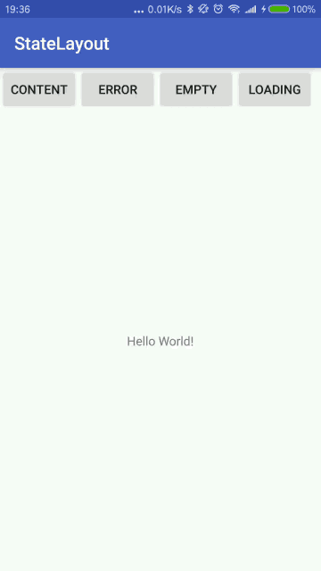

# StateLayout

A completely customizable StateLayout.



## Installation

**Step 1**. Add it in your root build.gradle at the end of repositories:

```groovy
allprojects {
    repositories {
        ...
        maven { url 'https://jitpack.io' }
    }
}
```

**Step 2**. Add the dependency

```groovy
dependencies {
    implementation 'com.github.eprendre:StateLayout:v0.2'
}
```

## Usage

1. Extends `StateLayout`.
1. Make sure each layout returned by `getStateLayouts` has an id.
1. Change layout by assigning `displayedChildId` with previously defined id. `R.id.state_content` is reserved for content.
1. Add features as you need. See example [CustomStateLayout](https://github.com/eprendre/StateLayout/blob/master/app/src/main/java/com/github/eprendre/statelayout/demo/CustomStateLayout.kt), [SimpleStateLayout](https://github.com/eprendre/StateLayout/blob/master/library/src/main/java/com/github/eprendre/statelayout/SimpleStateLayout.kt).

## Animation

Since this is a subclass of `ViewAnimator`, you can set animation directly from layout.

```xml
    <xxxStateLayout
        ...
        android:inAnimation="@android:anim/fade_in"
        android:outAnimation="@android:anim/fade_out"
        >
```

Programmatically: `setInAnimation();` `setOutAnimation();`